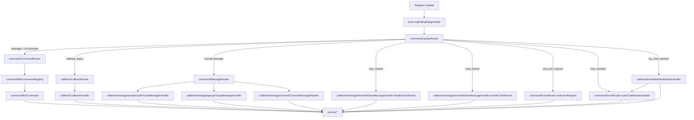

# TG Bot 流程图

```mermaid
flowchart TD
    A["Telegram Update"] --> B["bot/LongPollingTelegramBot"]
    B --> C["command/UpdateRouter"]

    C -->|"message + isCommand"| D["command/CommandRouter"]
    D --> E["command/BotCommandRegistry"]
    E --> F["command/BotCommand"]

    C -->|"callback_query"| G["callback/CallbackRouter"]
    G --> H["callback/CallbackHandler"]

    C -->|"normal message"| I["command/MessageRouter"]
    I --> J["callback/message/privatechat/PrivateMessageHandler"]
    I --> K["callback/message/group/GroupMessageHandler"]
    I --> L["callback/message/channel/ChannelMessageHandler"]

    C -->|"user_shared"| M["callback/message/share/IdShareMessageHandler.handleUserShared"]
    C -->|"chat_shared"| N["callback/message/share/IdShareMessageHandler.handleChatShared"]

    C -->|"chat_join_request"| O["command/EventRouter.routeJoinRequest"]
    C -->|"chat_member"| P["command/EventRouter.routeChatMemberUpdate"]
    C -->|"my_chat_member"| Q["callback/event/BotMembershipHandler"]
    Q --> P

    F --> R["service/*"]
    H --> R
    J --> R
    K --> R
    L --> R
    M --> R
    N --> R
    O --> R
    P --> R
    Q --> R
```
